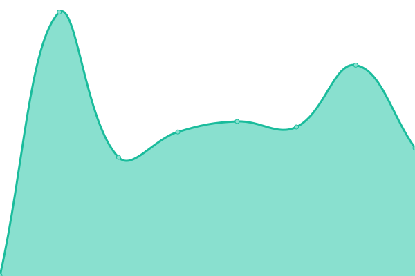
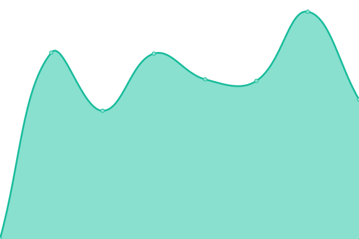
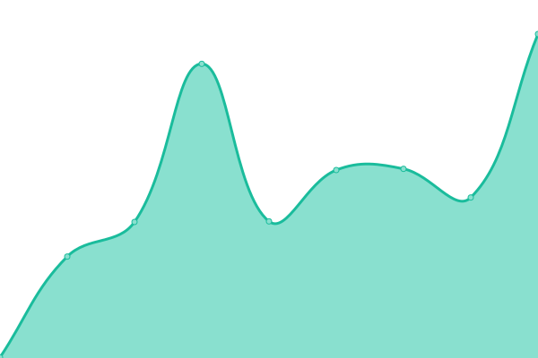

# [📈 Live Status](https://chen905.github.io/upptime_implement): <!--live status--> **🟧 Partial outage**

This repository contains the open-source uptime monitor and status page for [陳佳妤](https://im.mgt.ncu.edu.tw/), powered by [Upptime](https://github.com/upptime/upptime).

With [Upptime](https://upptime.js.org), you can get your own unlimited and free uptime monitor and status page, powered entirely by a GitHub repository. We use [Issues](https://github.com/chen905/upptime_implement/issues) as incident reports, [Actions](https://github.com/chen905/upptime_implement/actions) as uptime monitors, and [Pages](https://chen905.github.io/upptime_implement) for the status page.

<!--start: status pages-->
<!-- This summary is generated by Upptime (https://github.com/upptime/upptime) -->
<!-- Do not edit this manually, your changes will be overwritten -->
<!-- prettier-ignore -->
| URL | Status | History | Response Time | Uptime |
| --- | ------ | ------- | ------------- | ------ |
|  [Youtube](https://www.youtube.com) | 🟩 Up | [youtube.yml](https://github.com/chen905/upptime_implement/commits/HEAD/history/youtube.yml) | 

 271ms
     
 | 

<a href="https://chen905.github.io/upptime_implement/history/youtube">100.00%</a>
    

|  [Zuvio](https://irs.zuvio.com.tw) | 🟩 Up | [zuvio.yml](https://github.com/chen905/upptime_implement/commits/HEAD/history/zuvio.yml) | 

 1339ms
     
 | 

<a href="https://chen905.github.io/upptime_implement/history/zuvio">100.00%</a>
    

|  [Python](https://www.python.org) | 🟩 Up | [python.yml](https://github.com/chen905/upptime_implement/commits/HEAD/history/python.yml) | 

 65ms
     
 | 

<a href="https://chen905.github.io/upptime_implement/history/python">100.00%</a>
    

|  [Facebook](https://www.facebook.com) | 🟩 Up | [facebook.yml](https://github.com/chen905/upptime_implement/commits/HEAD/history/facebook.yml) | 

 320ms
     
 | 

<a href="https://chen905.github.io/upptime_implement/history/facebook">100.00%</a>
    

|  [Twitter](https://twitter.com) | 🟩 Up | [twitter.yml](https://github.com/chen905/upptime_implement/commits/HEAD/history/twitter.yml) | 

 207ms
     
 | 

<a href="https://chen905.github.io/upptime_implement/history/twitter">100.00%</a>
    

|  [104 job bank](https://www.104.com.tw) | 🟩 Up | [104-job-bank.yml](https://github.com/chen905/upptime_implement/commits/HEAD/history/104-job-bank.yml) | 

 2627ms
     
 | 

<a href="https://chen905.github.io/upptime_implement/history/104-job-bank">100.00%</a>
    

|  [invalid websites url of instagram](https://www.ingram.com) | 🟥 Down | [invalid-websites-url-of-instagram.yml](https://github.com/chen905/upptime_implement/commits/HEAD/history/invalid-websites-url-of-instagram.yml) | 

 0ms
     
 | 

<a href="https://chen905.github.io/upptime_implement/history/invalid-websites-url-of-instagram">100.00%</a>
    

<!--end: status pages-->

[**Visit our status website →**](https://chen905.github.io/upptime_implement)

## 📄 License

- Powered by: [Upptime](https://github.com/upptime/upptime)
- Code: [MIT](./LICENSE) © [陳佳妤](https://im.mgt.ncu.edu.tw/)
- Data in the `./history` directory: [Open Database License](https://opendatacommons.org/licenses/odbl/1-0/)
